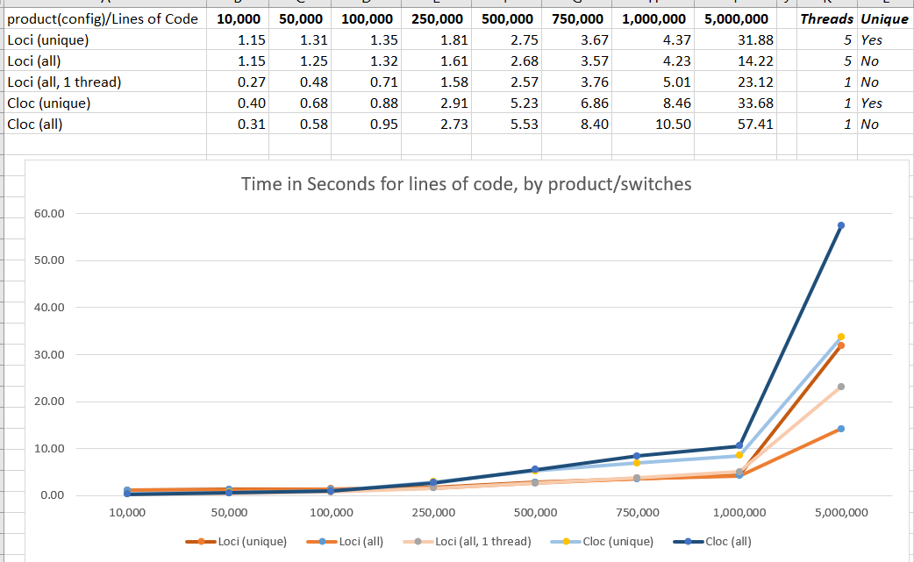

# Loci - Lines of Code Inventorizer

## Key Features
- Command Line Mode or NPM Library
- Command Line can take environment variables or switches
- Multiple output formats: Text, JSON, XML, HTML
- Over 200 languages supported
- Modern stacks like Node, Angular, Vue, C#, Terraform
- Automatic disambiguation where file extension could belong to more than one language
- Override disambiguation for speed with command line switches
- Multiple threads (automatically selects single-threaded mode for files counts below 1000)


## History
I have been a huge fan of [Cloc](https://github.com/AlDanial/cloc) for many years.  In fact, I have used it so often on new projects that other code counters just don't give me the confidence: I am always concerns that using another code counters are like comparinng apples to oranges.  They don't all work *quite* the same.

Unfortunately, many environments don't allow custom binaries, ruling out Perl scripts AND my personal go-to, cloc.exe.   

Node, however, is ubiguitous, so I decided to see if I could create a close cousin of cloc written in node.

I think I succeeeded, but the Open Source community will be the ultimate judge of that!

There is still a little apples-to-oranges between the two.  loci excludes folders bin, obj and .vscode by default, whereas cloc does not.  Cloc also has a very mature feature list that Loci does not: git repo querying, diffs, sql generation.  If you need those features, [Cloc](https://github.com/AlDanial/cloc) is by far your best choice.

Cloc is faster on smaller groups of files but only by fractions of a second.  For bulk scanning, Loci invokes worker threads so that counting can continue in parallel with file i/o.   

I think the big plus of loci is extensibility.  Definition files are stored as easily readable/editble YAML files, so new languages can be added quickly and easily.  And at ~7,500 LOC in 17 OO files to CLOC's 17,000 LOC in one script, its a little more maintainable, imo.

## Performance

We ran a few quick performance tests side-by-side with cloc, and came up with the following (encouraging) results:

|# Lines|	7,500|		340,000|	 5.5M|	
|:------|-------:|------------:|--------:|
|Loci	|	 0.24| 			2.4|	 37.9|
|Cloc	|	 0.22| 			3.7|	197.2|




## Command-Line Usage

To install for command line usage, enter the command 

```>npm install -g @0b1.org/loci```

To remove the CLI, enter the command 

```npm remove -g @0b1.org/loci```

Basic help:     

- Show help on basic usage and switches: ```loci --help```
- Show help on environment variables: ```loci --show:environmentals```
- Show the default options: ```loci --show:defaults```
- Show the current options: ```loci --show:options```  (includes any command line switches and selected folders)
- Show the language definitions: ```loci --show:languages```

Basic scanning:
- Scan a folder with default options ```loci c:\_dev\OLD_CODE\uisdk```
- Scan unique files in the folder    ```loci --unique c:\_dev\OLD_CODE\uisdk```
- Scan, but exclude folders named 'backup' ```loci --unique --xd:+backup c:\_dev\OLD_CODE\uisdk```
- Scan, but exclude ONLY folders named 'backup' ```loci --unique --xd:backup c:\_dev\OLD_CODE\uisdk```
    - (note the + symbol means, add these to the default excludes, but a missing + symbol means replace the defaults)

Separated lists in switches with semicolons. Separate lists of folders to scan with spaces.
(if your folder names have spaces, wrap them in double quotes)


## Library Usage

You can include the npm package in your own project.

In your current project enter the command ```npm install @0b1.org/loci```

For the simplest use, which just wraps the CLI, use:
```
const Loci = require ("@0b1.org/loci/lib/Loci");
Loci.CLIScan();
```

And you can run your own file as though it were loci:

```node index.js --unique .```

This, of course, is not much use, a more complete program would look like this:

```

    const OptionsLoader = require ("@0b1.org/loci/lib/OptionsLoader");
    const Loci = require ("@0b1.org/loci/lib/Loci");
    const Logger = require ("@0b1.org/loci/lib/Logger");

    const options = OptionsLoader.LoadDefaults();
    options.xf.push("not_this_folder");
    options.threads = 10;

    //the default logger logs to the console. 
    //Or pass in your own logger implementing the same methods
    const logger = new Logger(options, 0);
        
    //instantiate and scan
    const loci = new Loci(logger);      
    const output = loci.Begin(options);
        
    //format and display the output. 
    //Alternatively, process the json object elsewhere in your project.
    const formatter = new OutputFormatter(options);
    const textResult = formatter.Format(output);
    console.log(textResult);
```

That's it! Happy coding!


## Reporting Issues or feature requests

Please inlude the command line switches, environment variables, or programmatic options.
If possible, also include the code file that loci did not process as expected.

PLEASE check the existing bug list before submitting

If you would like a language added, you can experiment yourself by editing languages.yaml or send us some sample files.

You can contact me at sourcecoder0b1@gmail.com


## Contributing

Even a small open source project like this takes a fair amount of time.
If you would like to contribute, please let me know!

The license is MIT, so feel free to branch and experiment as you please. 
(But bear in mind it is benefits the community more if one project is improved than if multiple derivations exist)


## Compatibility

- Tested on node v16.0.0


## Known Issues

- Only tested on windows
- RTE scanning empty folder
- Cucumber tests all fail (due to return data changes rather than inaccurate results)
- The filter processing time exceeds the total processing time in multi-threaded mode :/


## Roadmap

The current release can be considered an MVP/Beta, but as issues are resolved, a full suite of features is intended:
- A --save-to: switch so that outputs don't need to be redirect to file. 
- A more robust scan for the 'comments in strings'/'strings in comments' circular conundrum, which can't be reliably solved with regular expressions.
- Implementation of diambiguation for extensions adso, d, v and a few other rarely used.
- Output as SQL inserts
- Use .gitignore to filter out files and folders
- Scan git repos
- Custom XSLT, JSON Transforms, and/or CSS for results formatting
- Custom definitions for disambiguation and languages
- Output files (scanned, unique, ignored, etc) to individual lists
- Scan inside archives
- Additional languages (on request)
- Addition of a main LociApp to replace multiple imports with unnecessarily long paths.


Finally, may the Source be with you...
- 0b1

